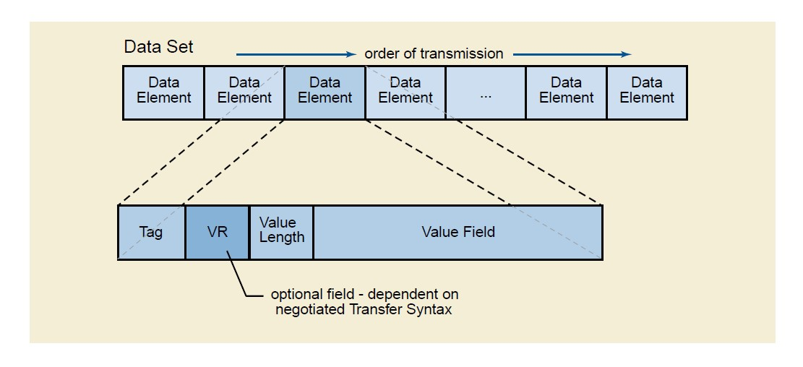
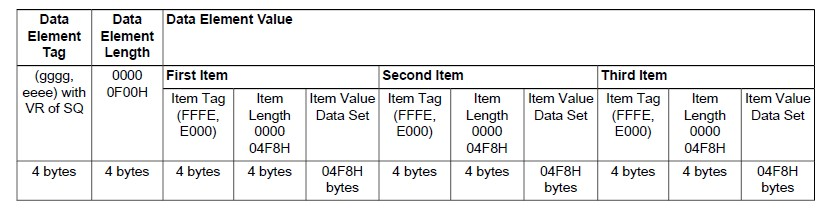
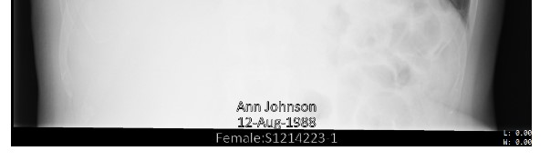
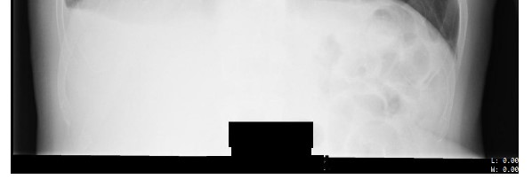

[[_TOC_]]
# Overview

[DICOM®](https://www.dicomstandard.org/) — Digital Imaging and Communications in Medicine — is the international standard for medical images and related information. It defines the formats for medical images that can be exchanged with the data and quality necessary for clinical use.

# Dicom Data Structure

1. DICOM groups information into data sets. Data Set is that portion of a DICOM Message that conveys information about real world objects being managed over the network.

2. A Data Set is constructed of Data Elements. Data Elements contain the encoded Values of Attributes of that object. A DICOM data object consists of a number of attributes, including items also one special attribute containing the image pixel data 

3. A Data Element is uniquely identified by a Data Element Tag. The Data Elements in a Data Set shall be ordered by increasing Data Element Tag Number and shall occur at most once in a Data Set.

    * Standard Data Elements have an even Group Number
    * Private Data Elements have an odd Group Number 

>Note: VRs are not contained in Data Elements when using DICOM Default Transfer Syntax (DICOM Implicit VR Little Endian Transfer Syntax).



|Field|Description|Details|
|-----|-----|-----|
|Data Element Tag|An ordered pair of 16-bit unsigned integers representing the Group Number followed by Element Number.|[All tags](http://dicom.nema.org/medical/Dicom/2017e/output/chtml/part06/chapter_6.html)|
|Value Representation(VR)|Two single byte characters describes the data type and format of that Data Element's Value(s).|[All VRs](http://dicom.nema.org/medical/Dicom/2017e/output/chtml/part05/sect_6.2.html)|
|Value Length|a 16 or 32-bit unsigned integer as the number of bytes (even) that make up the Value. a 32-bit Length Field set to Undefined Length (FFFFFFFFH) for SQ and UN or OW/OB somtimes.|
|Value Field|An even number of bytes containing the Value(s) of the Data Element. The Value Multiplicity specifies how many Values with this VR can be placed in the Value Field.|[Nesting of Data Sets](http://dicom.nema.org/medical/Dicom/2017e/output/chtml/part05/sect_7.5.html), <br>  [Pixel Data and Overlay Data](http://dicom.nema.org/medical/Dicom/2017e/output/chtml/part05/chapter_8.html), <br> [UIDs](http://dicom.nema.org/medical/Dicom/2017e/output/chtml/part05/chapter_9.html)|

## Nesting of Data Sets

The VR identified "SQ" shall be used for Data Elements with a Value consisting of a Sequence of zero or more Items, where each Item contains a set of Data Elements. SQ Data Elements can also be used recursively to contain multi-level nested structures.

### Example of a Data Element with Implicit VR Defined as a Sequence of Items (VR = SQ) with Three Items of Explicit Length



# Study of Google Dicom Anonimizer
## Overview
All operations are mixture of rules-based and heuristic methods.

||[De-id By Dicom Tags](https://cloud.google.com/healthcare/docs/how-tos/dicom-deidentify#de-identifying_dicom_tags)| [De-id By Sensitive Infotype](https://cloud.google.com/healthcare/docs/how-tos/dicom-deidentify#using_infotypes_and_primitive_transformations_with_dicom_tags)| [De-id Burnt-in text](https://cloud.google.com/healthcare/docs/how-tos/dicom-deidentify#redacting_burnt-in_text_from_images)|
|-----|-----|-----|-----|
|Description| Redect values by tags. (default or customized )| De-id values by sensitive types.( built-in infotypes or customized) |Recognize Burnt-in text and scan sensitive data to Infotype.|
|API Config|**DicomConfig:**<br>1. Keeplist.<br> 2. Removelist. <br>3. TagFilterProfile|**DicomConfig**: TagFilterProfile<br>**TextConfig**: transformations|**ImageConfig**: TextRedactionMode|
|De-id method|redact|Primitive transformations (redact/ dateshift/ cryptohash/ mask/ replace)| opaque rectangle|
|Algorithm|De-id algorithm|Infotype Detection.<br> De-id algorithm|Burnt-in text detection. <br> Infotype detection. <br>Pixel data modify.|

## De-id By Dicom Tags

### Keeplist
```
'config': {
        'dicom': {
          'keepList': {
            'tags': [
              'PatientID'
            ]
          }
        }
}

```
Tags should be kept: tag should kept for an instance.

The deidentify operation doesn't redact the preceding tags. However, the values for some of the tags are regenerated (
By default, [UID](http://dicom.nema.org/medical/dicom/current/output/chtml/part05/chapter_9.html) attribute will be regenerated using the [UUID](http://dicom.nema.org/medical/dicom/current/output/chtml/part05/sect_B.2.html) Derived UID method.)

When specify a keeplist, [default required tags](https://cloud.google.com/healthcare/docs/how-tos/dicom-deidentify#de-identification_using_keeplist_tags) will be added.

### Removelist

```
'config': {
        'dicom': {
          'removeList': {
            'tags': [
              'PatientBirthName',
              'PatientBirthDate',
            ]
          }
        }
}
```
The deidentify operation will redact only the tags specified in the list. When you specify a removelist, the OverlayData tag is added by default because overlay data might contain PHI.

The tags that are by [default added to a keeplist](https://cloud.google.com/healthcare/docs/how-tos/dicom-deidentify#de-identification_using_keeplist_tags)cannot be added to a removelist.

### Tag filter profile
 ```
'config': {
        'dicom': {
          'filterProfile': 'ATTRIBUTE_CONFIDENTIALITY_BASIC_PROFILE'
        }
      }
 ```
A tag filter profile is a pre-defined profile that determines which tags to keep, remove, or transform. See the following table for available profiles.
|Method|Description|
|-----|-----|
|TAG_FILTER_PROFILE_UNSPECIFIED | No tag filtration profile provided. Same as KEEP_ALL_PROFILE.|
|MINIMAL_KEEP_LIST_PROFILE|Keep only tags required to produce valid DICOM.|
|**ATTRIBUTE_CONFIDENTIALITY_BASIC_PROFILE**|Remove tags based on [DICOM Standard's Attribute Confidentiality Basic Profile](http://dicom.nema.org/medical/dicom/2018e/output/chtml/part15/chapter_E.html) |
| KEEP_ALL_PROFILE|	Keep all tags.|
|**DEIDENTIFY_TAG_CONTENTS**|Inspects within tag contents and replaces sensitive text.|

## De-id By Sensitive Infotype
 ```
'config': {
        'dicom': {
          'filterProfile': 'DEIDENTIFY_TAG_CONTENTS'
        },
        'text': {
          'transformations': [
            {
              'infoTypes': [
                'PERSON_NAME'
              ],
              'redactConfig': {}
            }
          ]
        }
      }
 ```
 An [information type(infoType)](https://cloud.google.com/dlp/docs/concepts-infotypes) is a type of sensitive data such as a patient name, email address, telephone number, identification number, or credit card number, which can be used to define what data it scans for when performing de-identification on tags.

 [Primitive transformations]() are rules that could be used for transforming an input value, including Redact, CharacterMask, Datashift, CryptoHash and ReplaceWithInfoType. 

  InfoTypes and primitive transformations are specified within an [InfoTypeTransformation](https://cloud.google.com/healthcare/docs/reference/rest/v1/DeidentifyConfig#infotypetransformation), which is an object inside of TextConfig. Specifying an infoType is optional. If you do not specify at least one infoType, the transformation applies to the [default DICOM infoTypes](https://cloud.google.com/healthcare/docs/how-tos/dicom-deidentify#default_dicom_infotypes) found in the Cloud Healthcare API.
## Redacting burnt-in text from images
```
'config': {
        'dicom': {},
        'image': {
          'textRedactionMode': 'REDACT_ALL_TEXT'
        }
      }
```
 Sensitive data burnt-in text could be detected by the API, which then obscures it using an opaque rectangle. The API returns the same DICOM images you gave it, in the same format, but any text identified as containing sensitive information according to your criteria is redacted.




# Candidate Features for us

||De-id By Dicom Tags or Dicom VRs| De-id By Sensitive Infotype| De-id Burnt-in text|
|-----|-----|-----|-----|
|Description| Redect values by tags or VRs. (default or customized )| De-id values by sensitive infotypes.( built-in infotypes or customized)|Recognize Burnt-in text and scan sensitive data to Infotype.|
|API Config||||
|De-id method|redact/ dateshift/ cryptohash/ perturb/ encrypt/ substitute/ generalize|redact/ dateshift/ cryptohash/ perturb/ encrypt/ substitute/ generalize| opaque rectangle|
|Algorithm|De-id algorithm|Infotype Detection. <br>De-id algorithm|Burnt-in text detection.<br>Infotype detection. <br>Pixel data modify.|

## Todo for De-id By Dicom Tags or VRs:
* Design configuration structure.
* Complete default configuration.
* Core De-id methods. 
    * Extract common API with Fhir.
    * refine code for Fhir.
    * Complete de-id functions for Dicom.
### A sample config
```
{
  "DicomTagRules": [
    {"name": "PatientName","method": "redact"},
    {"name": "ImageType","method": "keep"},
    {"name": "PatientID","method": "cryptoHash"}
  ],
  "DicomVRRules": [
    {"name": "DA","method": "dateshift"}
  ],
  "TagProfile": "ATTRIBUTE_CONFIDENTIALITY_BASIC_PROFILE",
  "parameters": {
    "dateShiftKey": "",
    "dateShiftScope": "resource",
    "cryptoHashKey": ""
  }
}
```

## Todo for De-id By Sensitive Infotype:

* Design sensitive infotype.
* Design infotype detectors.
* Recognize sensitive data by infotype and de-id.
* Support customize infotype and detector.

## Todo for De-id Burnt-in text:

* Regonize text in image.
* Recognize sensitive data by infotype and de-id.
* Opaque text in image.

# Useful Links

1. [Dicom standard](https://www.dicomstandard.org/).
2. [Google Healthcare API / De-identifying DICOM data](https://cloud.google.com/healthcare/docs/how-tos/dicom-deidentify).
3. [Open source de-id project for google](https://github.com/GoogleCloudPlatform/healthcare-deid).(Not updated yet, just for studying.)
4. [Real Sample data](https://github.com/sowu880/Dicom-demo/tree/main/data). (Personal collection.)

5. [Fake Dicom data](https://github.com/microsoft/dicom-server/tree/master/docs/dcms). (Used for Microsoft/dicom-server testing.)

6. [Source code of Microdoft/dicom-server](https://github.com/microsoft/dicom-server).
7. [Source code of fo-dicom lib for .Net Core](https://github.com/fo-dicom/fo-dicom).